# GIT
~~~
Git is a distributed version control sysystem used for tracking changes in source code
~~~
## Git Hooks
~~~
Git hooks are scripts that are triggered by specific events in the Git lifecycle.

Pre-Commit: This hook is executed before a commit is done. It is used to perform validation on the changes commited.

Post-Commit: This hook runs after a commit is completed. It's typically used for tasks that should occur after commiting changes such as sending emails or triggering build processes.
~~~
## Create a new branch & switch to that branch
~~~
git checkout -b <branchname>
            &&
git switch -c <branchname>
~~~
## Switch to an already existing branch
~~~
git checkout <branchname>
            &&
git switch <branchname>
~~~
## git init
~~~
git init is used to initialize a new git repository
git init
~~~
## git add
~~~
git add <filename> => used to add particular file to staging.

git add . => used to add all files and folders to staging
~~~
## git status
~~~
git status => display current state of git repository.

git status shows 
1.  untracked files
2.  changes to be committed
3.  it also show the current branch name
~~~
## git log
~~~
git log => this shows the commit history in a repo.
~~~
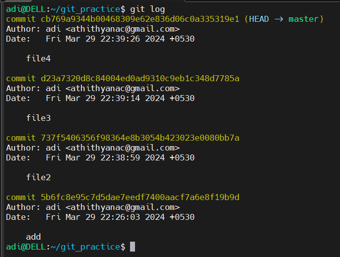

## git log --oneline
~~~
git log --oneline => this cmd shows commit history in a concise format
~~~
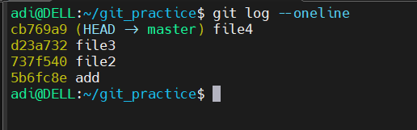

## git diff
~~~
git diff => git diff shows the changes made in 2 commits specified  
git diff old_commit latest_commit  
git diff HEAD~n HEAD
~~~
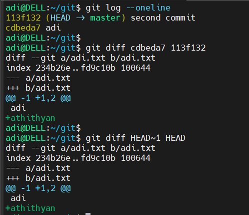

## git restore
~~~
git restore => this cmd helps to restore the changes to the file before staging and commiting it.
git restore <file_name>
~~~
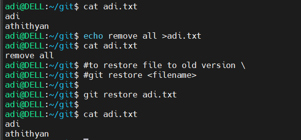

## git branch -m
~~~
git branch -m <newname> => this command rename the current branch where we are with newname
~~~
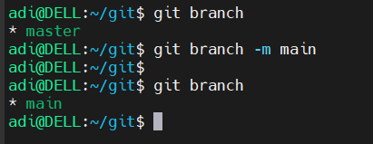

## git stash
~~~
git stash => is used to store files in staging area to a temp area called stash. In and out of the files in stash is in LIFO order.
~~~
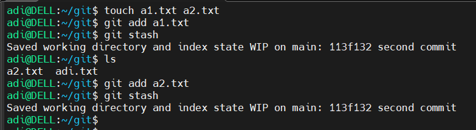

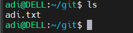

## git stash list
~~~
git stash list => displays the list of stashed objects
~~~
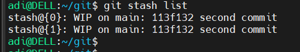

## git stash pop
~~~
git stash pop => to pop stashed item. git stash pop with pop objects in LIFO order. Objects can also poped out by git stash pop <stashid>
~~~
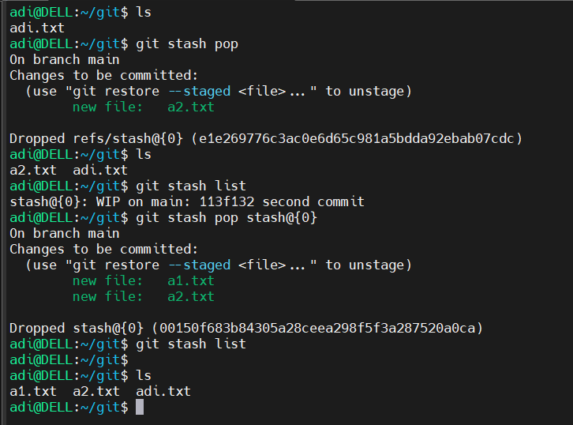

## git stash drop
~~~
git stash drop => this cmd will delete the stashed objects.
~~~
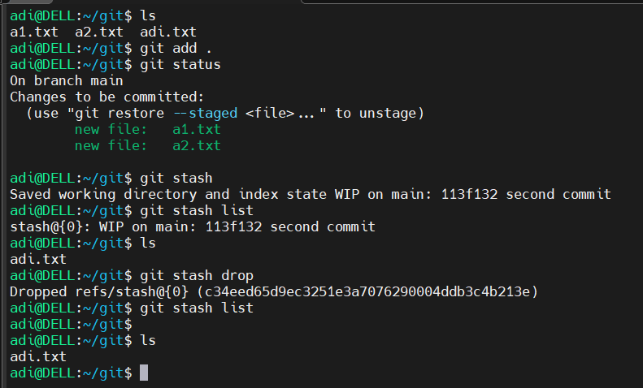

## git reset
~~~
git reset command is used to reset the current HEAD to a specified state.
~~~
~~~
1. Soft Reset 
    
    git reset --soft <commit id>
    
    This will reset and keep the changes in staging area.
~~~
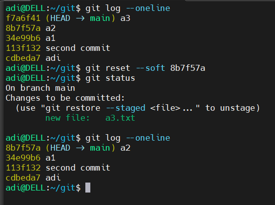
~~~
2. Hard reset
    
    git reset --hard <commit id>
    
    This will reset the commit and discard all changes after that. This will remove changes from staging and working directory.  
~~~
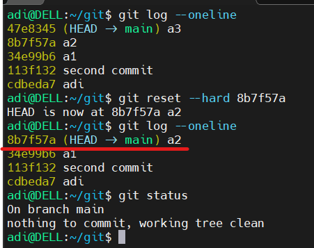

## Add remote repository
~~~
git add orgin <git reposirory url>
~~~
## Push objects to remote repo
~~~
git push origin <branch_name>
~~~

